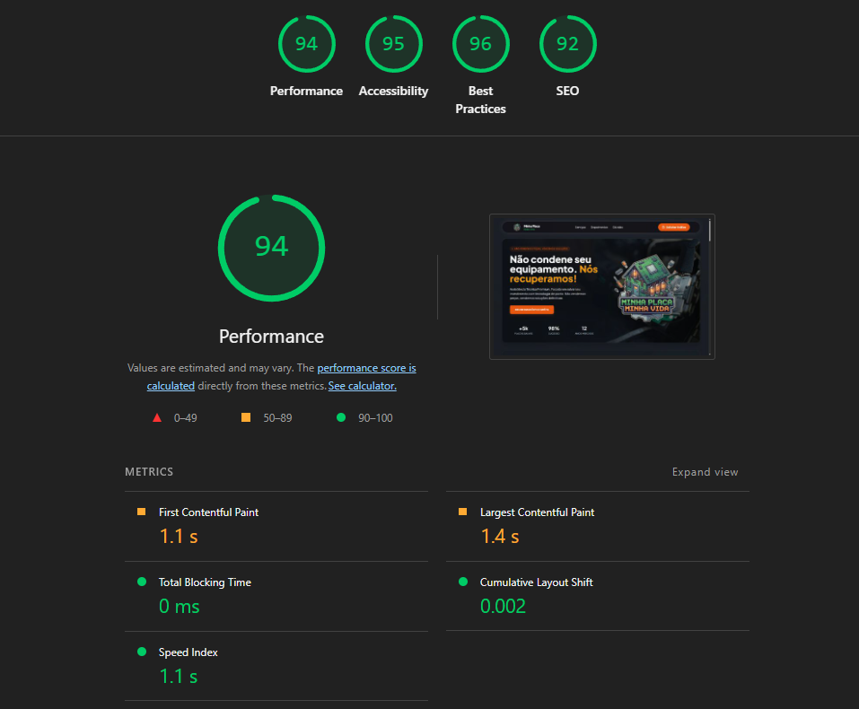

# 🔧 Minha Placa, Minha Vida

> **Assistência Técnica Premium especializada em eletrônicos e informática**
> Site desenvolvido como parte do processo seletivo Front-End na **FlyVet**


---

## 📋 Índice

- [Sobre o Projeto](#-sobre-o-projeto)
- [Tecnologias Utilizadas](#-tecnologias-utilizadas)
- [Decisões Técnicas](#-decisões-técnicas)
- [Arquitetura e Componentização](#-arquitetura-e-componentização)
- [Estratégia de Conversão (AIDA)](#-estratégia-de-conversão-aida)
- [Acessibilidade](#-acessibilidade)
- [Como Executar](#-como-executar)
- [Estrutura do Projeto](#-estrutura-do-projeto)
- [Funcionalidades](#-funcionalidades)

---

## 🎯 Sobre o Projeto

O **Minha Placa, Minha Vida** é um site institucional e de conversão para uma assistência técnica premium especializada em recuperação de eletrônicos. O principal objetivo é **transformar visitantes em leads qualificados no WhatsApp**, com o problema do cliente já pré-identificado para agilizar o atendimento técnico.

### Contexto do Desafio

Este projeto foi desenvolvido como parte do processo seletivo da **FlyVet** para a posição de Desenvolvedor Front-End React. O briefing solicitava:

- ✅ Design criativo no Figma
- ✅ Implementação em React com TypeScript
- ✅ Aplicação do modelo AIDA de conversão
- ✅ Fluxo de diagnóstico que redireciona para WhatsApp
- ✅ Página de detalhes de serviço
- ✅ Responsividade e acessibilidade

---

## 🛠️ Tecnologias Utilizadas

### Core
- **React 19.2.0** - Biblioteca principal com as últimas features
- **TypeScript 5.9.3** - Type safety e melhor DX
- **Vite 7.2.4** - Build tool moderna e rápida

### Estilização
- **Tailwind CSS 3.4.17** - Utility-first CSS framework
- **Google Fonts (Plus Jakarta Sans)** - Tipografia moderna e profissional
- **Lucide React** - Biblioteca de ícones consistente e leve

### Ferramentas de Desenvolvimento
- **ESLint** - Linting e padronização de código
- **PostCSS** - Processamento CSS
- **Autoprefixer** - Compatibilidade cross-browser

---

## 🧠 Decisões Técnicas

### 1. **Por que React 19.2.0?**
Optei pela versão mais recente para demonstrar familiaridade com as últimas features do ecossistema React, incluindo melhorias de performance e DX.

### 2. **Por que TypeScript?**
- **Type Safety**: Reduz bugs em tempo de desenvolvimento
- **Autocomplete**: Melhora produtividade
- **Documentação implícita**: Interfaces servem como documentação
- **Refatoração segura**: Mudanças são mais confiáveis

### 3. **Por que Tailwind CSS?**
- **Velocidade de desenvolvimento**: Classes utilitárias aceleram o processo
- **Consistência**: Design system integrado
- **Performance**: PurgeCSS remove CSS não utilizado
- **Customização**: Tema personalizado com cores da marca

### 4. **Por que Context API ao invés de Redux?**
- **Requisito do briefing**: Não usar Redux
- **Simplicidade**: Context API é suficiente para o escopo
- **Performance**: Menos boilerplate e overhead
- **Caso de uso**: Sistema de notificações (Toasts) é perfeito para Context API

### 5. **Por que Vite?**
- **Hot Module Replacement (HMR)**: Dev experience superior
- **Build otimizado**: Uso de Rollup para production
- **Velocidade**: Startup instantâneo
- **Ecossistema moderno**: Suporte nativo a TypeScript e React

### 6. **Por que Lucide React?**
- **Consistência visual**: Todos os ícones seguem o mesmo design system
- **Tree-shaking**: Importação individual reduz bundle size
- **Acessibilidade**: Suporte a aria-labels
- **Manutenção ativa**: Biblioteca bem mantida

---

## 🏗️ Arquitetura e Componentização

### Estrutura de Componentes

```
src/
├── components/
│   ├── Header.tsx              # Navegação com glassmorphism
│   ├── Hero.tsx                # Seção hero com AIDA (Atenção)
│   ├── Services.tsx            # Grid de serviços (Interesse)
│   ├── ServiceDetails.tsx      # Preview de serviço específico
│   ├── ServiceLanding.tsx      # Página dedicada ao serviço
│   ├── HowItWorks.tsx          # Como funciona o processo
│   ├── Warranty.tsx            # Garantias e segurança (Desejo)
│   ├── Testimonials.tsx        # Depoimentos sociais (Desejo)
│   ├── FAQ.tsx                 # Perguntas frequentes
│   ├── AdvancedDiagnostic.tsx  # Formulário de conversão (Ação)
│   └── Footer.tsx              # Rodapé com informações
├── contexts/
│   └── ToastContext.tsx        # Sistema de notificações global
├── App.tsx                     # Orquestrador principal
└── main.tsx                    # Entry point com providers
```

### Princípios Aplicados

#### ✅ **Componentização Granular**
Cada componente tem uma única responsabilidade, facilitando manutenção e reutilização.

#### ✅ **Separação de Concerns**
- **Lógica de negócio**: Isolada em hooks e contexts
- **Apresentação**: Componentes focados apenas em UI
- **Validação**: Centralizada no formulário

#### ✅ **Composição ao invés de Herança**
Componentes compostos para máxima flexibilidade.

#### ✅ **Props Tipadas**
Todas as props com interfaces TypeScript para segurança.

```typescript
interface ServiceLandingProps {
  onBack: () => void;
}

const ServiceLanding: React.FC<ServiceLandingProps> = ({ onBack }) => {
  // ...
}
```

---

## 🎯 Estratégia de Conversão (AIDA)

O modelo **AIDA** foi aplicado estrategicamente na estrutura do site:

### 🔴 **A - Atenção** (Hero Section)
**Localização**: `Hero.tsx`

- ✅ Headline impactante: _"Não condene seu equipamento. Nós recuperamos!"_
- ✅ Badge diferenciador: _"Não vendemos peças, vendemos soluções"_
- ✅ Stats sociais: +5k placas salvas, 98% sucesso, 12 anos no mercado
- ✅ Visual forte: Imagem de fundo + mascote da marca
- ✅ CTA imediato: _"Iniciar Diagnóstico Grátis"_

### 🟡 **I - Interesse** (Services)
**Localização**: `Services.tsx` + `ServiceLanding.tsx`

- ✅ Apresentação de expertise técnica (Micro-soldagem, Limpeza, Eletrodomésticos)
- ✅ Descrições claras dos serviços
- ✅ Página dedicada ao serviço principal (Conserto de Placa-Mãe)
- ✅ Detalhamento técnico: O que está incluso, tempo de execução

### 🟢 **D - Desejo** (Social Proof + Garantias)
**Localização**: `Testimonials.tsx` + `Warranty.tsx` + Comparativo

- ✅ Depoimentos reais com foto e caso específico
- ✅ Garantias claras: 3-6 meses, privacidade, laboratório próprio
- ✅ **Comparativo persuasivo**:
  - ❌ Trocar placa: R$ 2.500+ (peças usadas, perda de dados)
  - ✅ Nosso reparo: R$ 450-850 (economia de 70%, peça original, dados preservados)

### 🔵 **A - Ação** (Formulário de Diagnóstico)
**Localização**: `AdvancedDiagnostic.tsx`

- ✅ Formulário inteligente com validação em tempo real
- ✅ Campos estratégicos:
  1. Tipo de equipamento
  2. Serviço desejado
  3. Modelo do aparelho
  4. Descrição do problema (mín. 10 caracteres)
  5. Nome e email para contato
- ✅ **Redirecionamento WhatsApp** com mensagem pré-formatada:
  ```
  Olá, meu [notebook] [Dell G15] está com o problema: [não liga].
  Gostaria de um orçamento para o serviço de [micro-soldagem].

  Me chamo [João Silva] e meu e-mail é [joao@email.com]
  ```
- ✅ Feedback visual: Toast notifications (sucesso/erro)
- ✅ UX otimizada: Botão desabilitado durante envio, mensagens de erro claras

---

## ♿ Acessibilidade

Acessibilidade foi tratada como **prioridade**, não como adicional:

### ✅ **Semantic HTML**
```tsx
<section aria-label="Nossos Serviços">
  <nav aria-label="Navegação secundária">
  <main>
```

### ✅ **ARIA Attributes**
```tsx
<div role="img" aria-label="Avaliação: 5 de 5 estrelas">
<button aria-label="Voltar para a página inicial">
aria-hidden="true" // Para elementos puramente decorativos
```

### ✅ **Focus Management**
```tsx
focus:outline-none focus:ring-4 focus:ring-brand-orange/50
```

### ✅ **Motion Reduce**
Respeito às preferências de movimento reduzido:
```tsx
motion-reduce:transform-none motion-reduce:transition-none
```

### ✅ **Alt Text Descritivo**
```tsx

```

### ✅ **Contraste de Cores**
Todas as combinações de cores atendem WCAG AA:
- Texto principal: `#f0f6fc` sobre `#0d1117`
- Links: `#ea580c` (laranja vibrante)
- Feedback visual: Verde (#22c55e) / Vermelho (red-500)

---

## 🚀 Como Executar

### Pré-requisitos
- Node.js 18+ instalado
- npm ou yarn

### Instalação

```bash
# Clone o repositório
git clone https://github.com/Jessicac30/minha-placa-minha-vida.git

# Entre na pasta do projeto
cd minha-placa

# Instale as dependências
npm install
```

### Executar em Desenvolvimento

```bash
npm run dev
```

O projeto estará disponível em `http://localhost:5173`

### Build para Produção

```bash
npm run build
```

Os arquivos otimizados estarão na pasta `dist/`

### Preview da Build

```bash
npm run preview
```

### Linting

```bash
npm run lint
```

---

## 📁 Estrutura do Projeto

```
minha-placa/
├── public/                    # Arquivos estáticos
│   ├── logo.png              # Logo da marca
│   ├── photo.png             # Imagem do hero
│   ├── avatar-*.jpg          # Fotos dos depoimentos
│   └── placa-mae.png         # Imagem ilustrativa
├── src/
│   ├── components/           # Componentes React
│   │   ├── Header.tsx
│   │   ├── Hero.tsx
│   │   ├── Services.tsx
│   │   ├── ServiceDetails.tsx
│   │   ├── ServiceLanding.tsx
│   │   ├── HowItWorks.tsx
│   │   ├── Warranty.tsx
│   │   ├── Testimonials.tsx
│   │   ├── FAQ.tsx
│   │   ├── AdvancedDiagnostic.tsx
│   │   └── Footer.tsx
│   ├── contexts/             # React Context API
│   │   └── ToastContext.tsx  # Sistema de notificações
│   ├── App.tsx               # Componente principal
│   ├── main.tsx              # Entry point
│   ├── index.css             # Estilos globais
│   └── App.css               # Estilos do App
├── eslint.config.js          # Configuração ESLint
├── tailwind.config.js        # Configuração Tailwind
├── tsconfig.json             # Configuração TypeScript
├── vite.config.ts            # Configuração Vite
├── package.json              # Dependências
└── README.md                 # Este arquivo
```

---

## ⚡ Funcionalidades

### 🏠 **Home Page**
- [x] Hero section impactante com estatísticas
- [x] Grid de serviços com hover effects
- [x] Preview de serviço específico
- [x] Seção "Como Funciona"
- [x] Garantias e selos de confiança
- [x] Depoimentos de clientes com fotos
- [x] FAQ expandível
- [x] Formulário de diagnóstico
- [x] Footer com informações de contato

### 📄 **Página de Serviço Dedicada**
- [x] Navegação com botão "Voltar"
- [x] Hero específico do serviço
- [x] Galeria de imagens
- [x] Lista detalhada do que está incluso
- [x] Comparativo de preços (VS)
- [x] Formulário de conversão integrado
- [x] Animações de entrada suaves

### 📝 **Formulário de Diagnóstico**
- [x] Validação em tempo real
- [x] Feedback visual de erros
- [x] Campos obrigatórios com validação customizada:
  - Equipamento (select)
  - Serviço desejado (select)
  - Modelo (texto, mín. 1 caractere)
  - Problema (textarea, mín. 10 caracteres)
  - Nome (texto, mín. 3 caracteres)
  - Email (validação de formato)
- [x] Contador de caracteres no textarea (max 500)
- [x] Mensagem pré-formatada para WhatsApp
- [x] Toast notifications de sucesso/erro
- [x] Delay de 2s antes do redirect (melhor UX)

### 🔔 **Sistema de Notificações (Toasts)**
- [x] Context API para gerenciamento global
- [x] 4 tipos: success, error, warning, info
- [x] Auto-dismiss após 3 segundos
- [x] Animações de entrada (slide-in)
- [x] Ícones contextuais (Lucide React)
- [x] Posicionamento fixed (top-right)

### 🎨 **Design System**
- [x] Paleta de cores customizada:
  - Brand Green: `#22c55e`
  - Brand Orange: `#ea580c`
  - Background: `#0d1117`
  - Components: `#161b22`
- [x] Tipografia: Plus Jakarta Sans
- [x] Animações customizadas (float, fade-in)
- [x] Glassmorphism no header
- [x] Gradientes sutis

---

## 📊 Performance & SEO - Lighthouse Audit

### 🎯 Resultados da Auditoria

Auditoria completa realizada com **Google Lighthouse** (Chrome DevTools) em ambiente de **produção**.

**Data**: 18/12/2024 | **Device**: Desktop | **Build**: Production (Vite)




## 📝 Licença

Este projeto foi desenvolvido para fins educacionais e de avaliação técnica.

---
